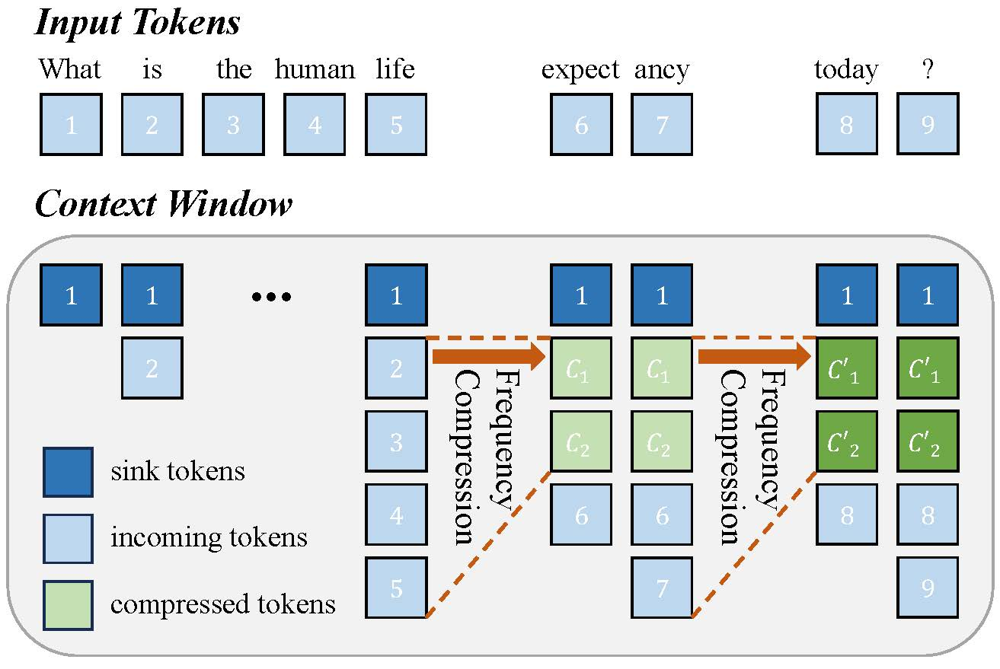

# FreqKV

<p align="center">
  
</p>

**FreqKV** is an efficient context extension method that iteratively compresses key-value states in the frequency domain.

📄 **Paper**:  
[FreqKV: Key-Value Compression in Frequency Domain for Context Window Extension](https://arxiv.org/abs/2505.00570)

🏆 **Status**:  
Accepted to **ICLR 2026**

## Setup

Run the following code:
```
pip install -r requirements.txt
pip install flash-attn --no-build-isolation
```

## Training 
### Fine-tuning
```
bash train-flash.sh
```

- Please remember to change `path_to/Llama-2-7b-hf`, `path_to_saving_checkpoints`, `path_to_cache` to your own directory.
- Note that you can change `model_max_length` to other values.
- You could change `ds_configs/stage2.json` to `ds_configs/stage3.json` if you want.
- When training is finished, to get the full model weight:
```
cd path_to_saving_checkpoints && python zero_to_fp32.py . pytorch_model.bin
```
Note that the path_to_saving_checkpoints might be the global_step directory, which depends on the deepspeed versions.

### Supervised Fine-tuning
```
bash sft.sh
```
- Our long instruction following data can be found in [LongAlpaca-16k-length.json](https://huggingface.co/datasets/Yukang/LongAlpaca-16k-length).


### Merge LoRA Weight
In low-rank training, we set embedding and normalization layers as trainable. Please use the following line to extract the trainable weights `trainable_params.bin` from `pytorch_model.bin`.

Merge the LoRA weights of `pytorch_model.bin` and trainable parameters `trainable_params.bin`, save the resulting model into your desired path in the Hugging Face format:
```
bash merge.sh
```


## Evaluation
### Perplexity Validation

```
bash test.sh
```

- Note that `--seq_len` is to set the sequence length for evaluation. `--context_size` is to set the context length of the model during fine-tuning.

- We have already tokenized the validation and test splits of PG19 and proof-pile dataset into `pg19/validation.bin`, `pg19/test.bin`, and `proof-pile/test_sampled_data.bin`, with the tokenizer of LLaMA. `proof-pile/test_sampled_data.bin` contains 128 documents that are randomly sampled from the total proof-pile test split. For each document, it has at least 32768 tokens. We also release the sampled ids in [proof-pile/test_sampled_ids.bin](https://drive.google.com/file/d/1cnzWODLRQYAd7HeugzLCIhaqzaLZv7J5/view?usp=share_link). You can download them from the links below.

| Dataset    | Split      | Link                                                                                                         |
|:-----------|------------|--------------------------------------------------------------------------------------------------------------|
| PG19       | validation | [pg19/validation.bin](https://drive.google.com/file/d/1rbJvb0qRIf2mQoN2ON7S93TbTzMnlrN6/view?usp=share_link) |
| PG19       | test       | [pg19/test.bin](https://drive.google.com/file/d/1QANDMdctpacPAYgS04adDXqByGEq-Ret/view?usp=share_link)       |
| Proof-pile | test       | [proof-pile/test_sampled_data.bin](https://drive.google.com/file/d/1bUI5lPDvrqzY_XXJJ2sSuvZx0Y9AZClE/view?usp=share_link)         |
 

### Downstream taks

We follow instructions of [LongBench](https://github.com/THUDM/LongBench/tree/main/LongBench), [OpenCompass](https://github.com/open-compass/opencompass) and [KVCache-Factory](https://github.com/Zefan-Cai/KVCache-Factory) to evaluate the performance of FreqKV on LongBench, RULER and Needle-in-a-Haystack.

## Citation

If you find this work useful, please cite:

```bibtex
@article{freqkv2026,
  title     = {FreqKV: Key-Value Compression in Frequency Domain for Context Window Extension},
  author    = {Jushi Kai, Boyi Zeng, Yixuan Wang, Haoli Bai, Bo Jiang, Ziwei He, Zhouhan Lin},
  journal   = {International Conference on Learning Representations (ICLR)},
  year      = {2026}
}